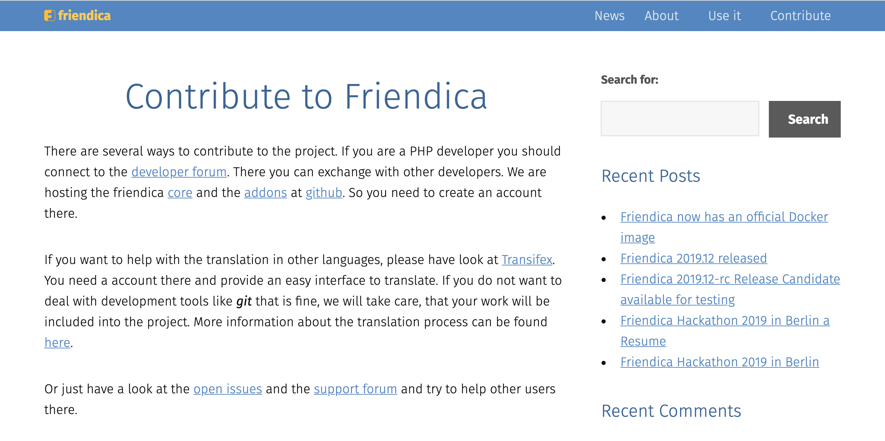

## Thinking About OS projects
### What to look for in a project
We have looked at several open sourced projects in class on Monday, and the beginning point is usually the website of the project. Most of the available information are listed on the website: what the project is used for; how to use the project; how to contribute to the project; where to download the project; the link to the repository; etc. The websites are different in general, as some have sophisticated design and many different pages, and some are just informative with little design. The main function, in my opinion, is to tell the users what it is and lead the contributors to the repository. 

The second, and the most important component for contributors is the repository. I usually look at the languages used first, to make sure the project is not written in a language that I have no experience with. Then, I would check their readme file to locate myself with the different contents. The contributing/contribution file is always important to look at, too. I would also pay attention to the timeline of the repository, to see how responsive or active the contributors are. I would generally be more inclined to work on projects with an active group of users. 

### Looking for a project
I started with browsing some recommended projects for beginners, and I did find them to be very different. I found an interesting repository that teaches you how to contribute to an open-source project on GitHub with local terminal. It is similar to the activity we did in class, but I still made my contribution to it to solidify my knowledge. Then I started to look for a target-oriented project. I found one that interest me a lot, which is a website with many user-created courses. The topics of the courses include coding, science, math, languages, and even baking. I looked further into its repository, and found that the majority of the code is written in GO, which I am not familiar with, so I passed on this project. I found another interesting project for new open source contributors, it is called frindica. The website looks very opganized and user friendly 

I plan to continue looking next week and hopefully I will be able to find something that I am interested in and able to contribute to.

### Bloomberg’s Open-source
I have used the main product of Bloomberg for one of my internship previously. When Kevin introduces why Bloomberg need such a specialized product, it did not surprise me. Because I could imagine how big of a volume of data they need to process on a daily basis. However, I did learn much from the talk in terms of the usefulness of open source projects or softwares. The biggest advantage of them is that developers are able to build up on them to satisfy the special needs of a company. The freedom and possibilities of open source softwares is one of their most attractive qualities. 
