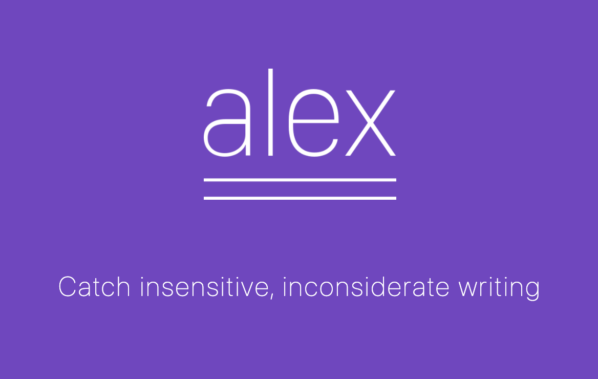

## Another round of evaluation
In class on Monday, we did another round of project evaluation. This is a good chance to learn about another set of interesting open-source projects.  In Wednesday’s lecture, we looked at different Open Source projects that are success in making profit.

### projects we talked about on monday
In Monday’s lecture, we talked about a list of open-source projects that we have not seen before, at least for me. Some of the projects are used for the current  covid pandemic, while most of the others serve purposes that are completely irrelevant to the disease. They are all classified as Humanitarian Free Open source softwares. From my understanding, this group of project are aiming to help a certain group of people. This could be a group of minority, or just a group with some similar characteristics. For example, Oppia is aiming to help a group of people who want to learn something that they are not necessarily farmiliar with.   

### Potential difficulties 
When I think about FOSS projects, I often consider it to be the more sophisticated group of Open Source projects. This is because they need to have some advanced functionalities in order to help the group. Not like other open source projects, which can be creative in many of its own ways, a FOSS project need to make sure that it is serving the purpose of making someone’s life easier or helping a certain group of people. There might needs to be some professional knowledge involved in the project. For example, a project that aims to help people that have trouble seeing or hearing needs to involve in sign languages. This requires a group of its contributors to understand sign languages, which limit the people who can actually contribute. 

### Alex, what happened?
Towards the end of the class, we choose to look at some specific projects. I was very interested in one of them, and joined the group to look at the project and do a short project evaluation on it. Alex is an open source software that catches insensitive and inconsiderate writing. 

This project caught my attention because I think it has the potential of becoming an extremely useful tool. The definition of insensitive and inconsiderate could be applied to many different situations, and with the essential algorithm to detect the cases, it can potentially serve many different purposes. I was very excited to look at how the project is doing now. In the group I was assigned to, I was in charge of looking at the current activities of the project. The results that I found surprised me quite a bit. The project is almost not active at all, with 9 pull requests in the past 6 month. This is extremely low compared to projects I have looked at in this course previously. This is counter-intuitive since this is a project I had a lot of expectations on, especially when we are in a world that emphasizes equality and rights of all types. I did not expect the project to have so little improvements. We took a closer look at its repository, and it seems like the project came out in the end of 2018, and it was actually quite active back then. However, since the essential contributors were only one or two people, there is limited amount of work they could do. I think this is a good reminder that when I choose a certain project to contribute to, I would focus on how many maintainers there are on a certain project, because this number could potentially hurt the future growth of the project. 

### Open source and making profit, how?
In Wednesday’s lecture, we looked at different Open Source projects that are success in making profit, which seems to be counter-intuitive to me at first, because open-source are supposed to be free, and how does free software make money? The answer is that open source projects are able to be used for a certain part of a business model. Some examples are given, such as software consulting and subscription offering. We also took a specific look at Open Core, which is a very clear example of how open source projects can be very serious and serve a significant purpose. Towards the end of the class, we had a discussion about what we think about the course as a whole. I feel similar with my peers, that I got to know open source a lot more, including how it works, what it can be used for, and how powerful it is. 
